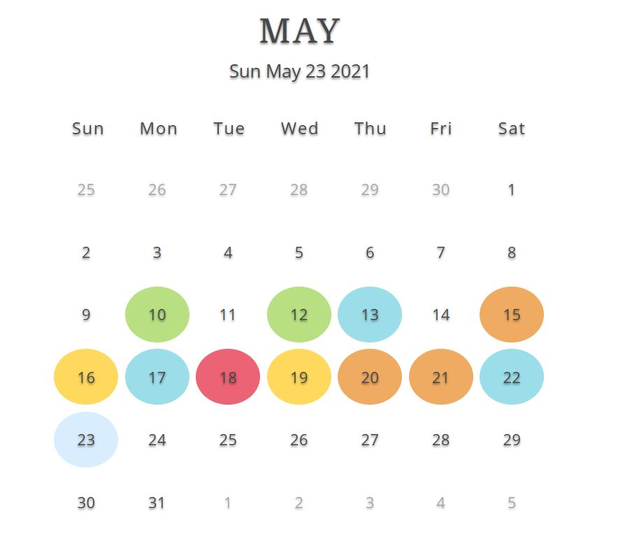

# Vibe Mood Tracker 
Link to Application: https://pacific-lake-95898.herokuapp.com/

## Description
As  Full-Stack Web Developers, we wanted to create a tool to help individuals prioritize their mental well-being, by allowing them to track their mood daily and complete journal entries with predetermined questions. Each day the user will be able to select their mood for the day, add a journal entry, add a photo and submit for tracking. 

## Table of Contents
* [Title](#Title)
* [Description](#Description)
* [Usage](#Usage)
* [Screenshots](#screenshots)
* [Contributing](#Contributing)

## Usage
Follow the sign-up instructions to create your personal account and start tracking your mood.

## Screenshots

Please see below for two snapshots of this website:

* Dashboard

* Landing Page

## Contributors
Anthony Hall, George Wise, Nichole Christianson, Shirin Shahram, Zhypara Abdieva

